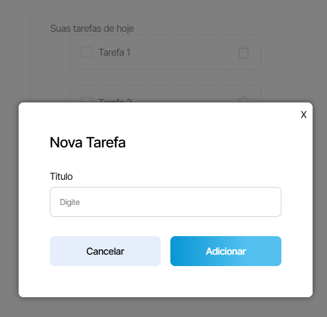
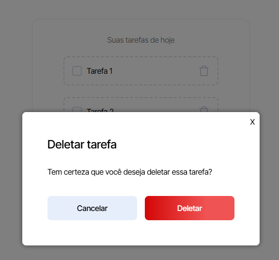

# FocalPoint 📝
## ToDo List App feito com React, Next.js e SCSS
Aplicação de lista de tarefas simples e eficiente, criada para ajudar os usuários a organizar suas tarefas do dia a dia. Este projeto foi desenvolvido com foco em boas práticas de desenvolvimento, utilizando as tecnologias mais modernas como React e Next.js, além de estilos com SCSS.

Esse projeto foi um teste para uma vaga junior

# 📋 Funcionalidades
- Adicionar tarefas com título
- Remover tarefas
- Visualizar tarefas pendentes e finalizadas
- Responsividade: funciona bem tanto em dispositivos móveis quanto em desktops
- Data formatada: Função que utiliza Intl.DateTimeFormat para exibir a data no formato brasileiro

# 🛠️ Tecnologias Utilizadas
- Next.js (v14.2.13): Framework para React com renderização do lado do servidor (SSR) e otimização de SEO.
- React (v18): Biblioteca para criação de interfaces de usuário.
- SCSS/Sass: Para estilização modular e flexível.
- TypeScript: Tipagem estática para código JavaScript mais seguro.
- ESLint: Ferramenta de linting para manter o código limpo e consistente.

# 🚀 Instruções de Instalação
### Pré-requisitos:
- Node.js (versão recomendada: ^18)
- npm instalado globalmente
### Passos para rodar o projeto:

1. Clone o repositório:

```
git clone
```

2. Instale as dependências:
```
npm install
```
3. Rodar o ambiente de desenvolvimento: 
```
npm run dev
```

# 🔍 Preview


 